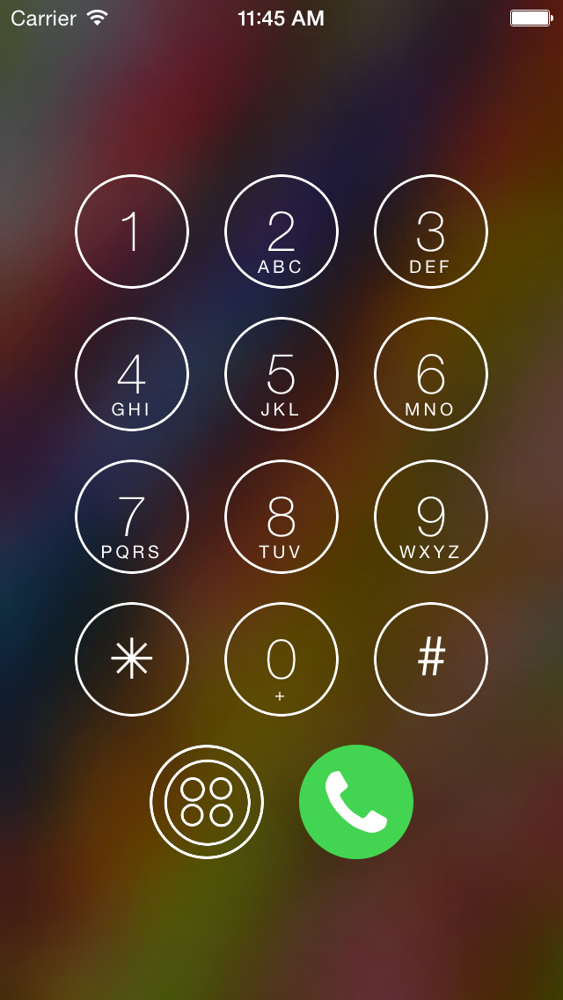
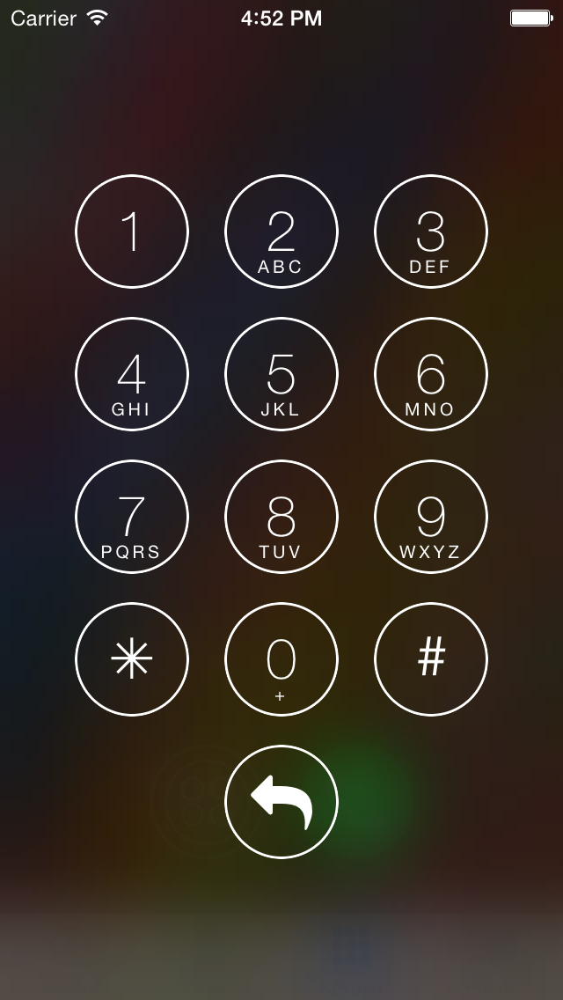

# JCDialPad
JCDialPad is a customizable view which allows you to create button menus in the style of the iOS 7/8 keypad and pin pad views. Here are some examples of views created using JCDialPad:

 &nbsp; 
 &nbsp; 


## Features
- Fully customizable buttons with useful defaults
- Automatically format phone numbers as you type with any region supported by libPhoneNumber
- Set a background image with a frosted overlay
- Handle button presses (both long and short) in multiple different ways using two simple delegate methods
- Buttons are automatically laid out in centered rows of three
- Most colors and fonts can be customized using UIAppearance, or set directly
- Scales properly on all device sizes including iPad

## Installation
[CocoaPods](http://cocoapods.org) is the easiest way to manage your iOS/OSX dependencies. Check out their getting started guide to see how to set it up. Once you do, simply add this line to your podfile:

```ruby
pod "JCDialPad"
```

## Usage

Creating a standard keypad view with buttons 1-9, *, and # is as simple as this:

```objectivec
JCDialPad *pad = [[JCDialPad alloc] initWithFrame:self.view.bounds];
pad.buttons = [JCDialPad defaultButtons];
pad.delegate = self;
[self.view addSubview:pad];
```

Check out the Demo project to get a sense of how to create more complex views, add a background image, and create your own buttons using images or iconic fonts.

### Customising the Appearance
Most colours and fonts used within the module can be set using the UIAppearance proxy. The example project shows how to do this, but for a more in depth look at UIAppearance check out the docs [check out the docs](https://developer.apple.com/library/ios/documentation/uikit/reference/UIAppearance_Protocol/Reference/Reference.html) or check out [Matt Thompson’s article on NSHipster](http://nshipster.com/uiappearance/).

## Known Issues

- Crazy stuff happens in landscape mode.
- Buttons just start to run off the screen if you add too many. Not sure what the best choice would be to do in this case.
- I would really like to get the actual iOS 7 phone keypad visual styling – where the frosted overlay is white, and pressing the buttons actually makes them become more translucent, revealing the colors of the background image.

## License
JCDialPad is available under the MIT license. See the LICENSE file for more info.
